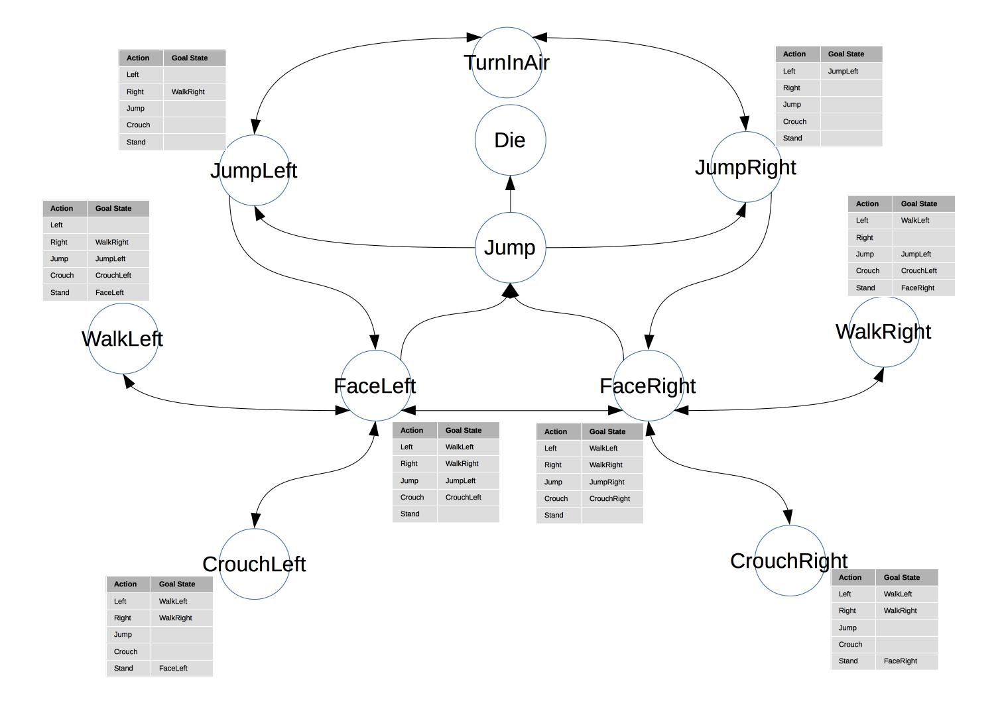

# Space-Man State-Machine

This project uses my implementation of a generic state machine to control the behaviour of a small animated space-man.

A state machine, in this implementation consists of:
* Some states which define behavior of the context object when entering, or leaving the state, or while in the state. See ```statemachine.State.java```
* Edges which connect states together to form a graph. See ```statemachine.Edge.java```
* Actions which define the states that the object can move towards while in any given state. See ```statemachine.ActionList.java```
* A search algorithm that finds the shortest path from a source state to a goal state. See ```statemachine.StateMap.java```
* A class which ties all of this together. See ```statemachine.StateMachine.java```

Once states are organized in a meaningful graph, and the state machine will move the object between states by moving through the shortest possible path defined by a graph (defined by the edges connecting states). This also ensures that all state changes are executed in between simulation steps, when used with the game engine used here (a slightly modified version of jBox2d supplied by my universit). This helps avoid concurrency errors within the physics engine.

This is best demonstrated in the ```bodies.spaceman.SpaceMan.java``` class. The states, edges and actions defined in the constructor are representative of the following graph:

